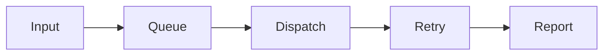

# telegram-spam-booster 🚀📨

  

*A message-throughput booster for Telegram, built for communities that need volume, consistency, and control.*

  

---

## 🧭 Overview

**telegram-spam-booster** is a Windows-native message dispatch utility engineered around one idea: broadcasting at scale in Telegram shouldn't require you to duct-tape together bots, scripts, and API wrappers just to send the same announcement to fifty groups. It exists because the gap between "Telegram Bot API" and "actually running a real outreach campaign" is filled with rate limits, flood-wait errors, session drops, and a lot of manual babysitting. This project closes that gap with a single executable that manages queues, paces requests intelligently, and gives you a dashboard instead of a terminal full of stack traces.

The tool sits at the intersection of **community management**, **marketing automation**, and **Telegram Spammer**-style broadcast tooling — the kind of software that admins, growth hackers-turned-legit-marketers, event organizers, and open-source project maintainers reach for when they need to notify hundreds of channel members without triggering Telegram's abuse detection every five minutes. It's not a bot framework. It's not a library you compile against. It's a booster — a layer that sits between your intent ("send this to these groups") and Telegram's transport layer, smoothing out the friction in between.

Who is this for? Primarily: **Discord-to-Telegram migrators**, **NFT/crypto community mods** (yes, we know, we built in extra throttling for that specific pain), **indie devs promoting a launch**, and **open-source maintainers** cross-posting release notes to multiple community channels. If you've ever copy-pasted the same message into fifteen Telegram tabs by hand, this tool was built with your specific frustration in mind.

---

## ⚡ Quick Start

> [!TIP]
> You'll be sending your first broadcast in under three minutes. No compiling, no dependency hell.

1. Visit the landing page via the download button above and grab the latest Windows build.

2. Run the executable — no installer wizard, no admin prompt, just double-click and go.

3. Paste your target list, write your message once, hit **Send**, and watch the queue drain in real time.

That's the whole onboarding flow. Everything below explains *why* it's built this way.

---

## 🔩 What Makes It Tick

- **Adaptive pacing engine** — instead of firing messages as fast as the API allows (which gets you flood-limited in minutes), the booster studies response latency and backs off dynamically, the same way TCP congestion control avoids saturating a pipe.

- **Session-aware dispatch** — rather than treating every send as a stateless HTTP call, the tool maintains persistent session context per target, reducing redundant handshakes and cutting failure rates on large runs.

- **Multi-target queueing** — group and channel destinations are queued independently so a slow or rate-limited target never blocks the rest of your broadcast list.

- **Template variables** — drop `{name}`, `{group}`, or custom tokens into your message and the booster interpolates them per-recipient, so "spam" doesn't have to mean "identical."

- **Retry-with-backoff logic** — transient failures (network blips, temporary flood-wait windows) are retried on an exponential schedule instead of silently dropped or hammered repeatedly.

- **Local-only operation** — everything runs client-side on your machine; there's no cloud relay holding your message list or credentials.

- **Live activity console** — a scrolling, filterable log shows exactly what's being sent, to where, and what came back, so you're never flying blind on a 500-target run.

- **Cross-session resume** — close the app mid-run and reopen it; the booster picks the queue back up instead of forcing a restart from zero.

> [!NOTE]
> Every capability above exists to solve a specific failure mode we hit while stress-testing the tool against Telegram's real-world rate ceilings — this isn't a feature checklist, it's a scar tissue list.

---

## 🖥️ System Requirements

| Requirement | Details |
|---|---|
| OS | Windows 10 or Windows 11 (64-bit) |
| Dependencies | None — fully standalone executable |
| Disk space | ~80 MB |
| Network | Stable internet connection |
| Runtime | No .NET/Python install required |

  

---

## 🏗️ How It Works

The architecture is deliberately simple on the outside and layered on the inside. Here's the flow a single broadcast takes from your keyboard to a recipient's chat:

1. **Input capture** — your message, variables, and target list are parsed and validated locally before anything touches the network.

2. **Queue construction** — targets are sorted into independent lanes so pacing decisions for one group never starve another.

3. **Adaptive dispatch** — each lane sends at a rate informed by recent response times, not a fixed hardcoded delay.

4. **Response handling** — successes are logged, failures are classified (transient vs. permanent) and routed to the retry scheduler or the dead-letter view.

5. **Live reporting** — the console updates in real time so you can pause, adjust, or abort without losing queue state.

> [!IMPORTANT]
> The retry scheduler is what separates a booster from a blunt-force script — without it, a single flood-wait response can silently kill an entire campaign.

---

## 🧯 Troubleshooting

<strong>My messages are getting delayed longer than expected</strong>

That's the adaptive pacing engine responding to elevated response latency from Telegram's servers. It's protective, not broken — forcing faster sends is how accounts get limited.

<strong>The app closed mid-run — did I lose my queue?</strong>

No. Cross-session resume reloads unfinished queue state on next launch. Reopen the app and continue where you left off.

<strong>Some targets show a permanent failure instead of retrying</strong>

Permanent failures (invalid group, blocked target, deleted channel) are intentionally excluded from the retry schedule so they don't waste cycles on unreachable destinations.

<strong>Windows SmartScreen flagged the executable</strong>

This is common for independently signed tools distributed outside the Microsoft Store. Verify you downloaded from the official landing page linked in this README before proceeding.

<strong>Can I run multiple campaigns at once?</strong>

Yes — each campaign runs its own independent queue and pacing profile, so parallel campaigns don't compete for the same throttle budget.

> [!WARNING]
> Aggressive manual overrides of the pacing engine will increase your rate-limit exposure. The defaults exist because we tested the alternative extensively.

---

## 🎨 UI / UX Details

- **Themes**: Light, Dark, and a high-contrast "Console" theme for long monitoring sessions.

- **Keyboard shortcuts**:
  - `Ctrl+Enter` — send current queue
  - `Ctrl+P` — pause/resume dispatch
  - `Ctrl+L` — clear activity log
  - `Ctrl+,` — open settings

- **Settings panel** — persists pacing profile, theme, and default template variables between sessions.

- **Activity console filters** — toggle between *All*, *Successes*, *Retries*, and *Failures* without losing scroll position.

> [!TIP]
> Pin the activity console filter to *Retries* when running your first large broadcast — it's the fastest way to spot a misconfigured target list early.

---

## 🤝 Contributing & Community

This project grows through community contributions, and we mean that beyond the boilerplate — a huge share of the pacing heuristics currently in the booster came directly from issue reports on real-world flood-wait behavior.

- Check the **good-first-issue** label for approachable entry points into the codebase.

- Opening an issue with reproduction steps is just as valuable as opening a pull request — clear bug reports shape the roadmap.

- New contributors are welcome regardless of experience level; the maintainers actively review and mentor through PR feedback.

- Discussion threads are open for feature proposals before implementation, so design gets debated before code gets written.

> [!NOTE]
> First-time contributor? Start with documentation or the troubleshooting section above — small, well-scoped PRs get merged fast and are the easiest way to earn maintainer trust.

---

## 📜 License

Released under the [MIT License](LICENSE), 2026.

---

## ⚠️ Disclaimer

This tool is provided for legitimate community management, marketing outreach, and communication automation on Telegram. Users are solely responsible for complying with Telegram's Terms of Service and all applicable laws in their jurisdiction regarding unsolicited messaging. The maintainers do not endorse or support use of this software for harassment, unsolicited bulk messaging to non-consenting recipients, or any activity that violates platform policies.

